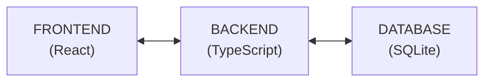
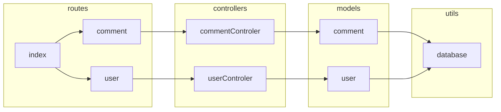

# ESM Fórum

O **ESM Fórum** é um sistema de demonstração do livro [Engenharia de Software Moderna](https://engsoftmoderna.info). O objetivo é permitir que os alunos tenham um primeiro contato prático com os conceitos estudados no livro.

Do ponto de requisitos funcionais, o sistema é um fórum simples de perguntas e respostas, conforme ilustrado a seguir:

<p align="center">
    
</p>

Do ponto de vista tecnológico, o sistema é implementado em TypeScript, usando Node.js, React e SQLite.

Informações para instalação e execução podem ser encontradas [aqui](https://github.com/aserg-ufmg/esmforum/blob/main/install-info.md).

## Histórias de Usuário

#### Backlog do Produto

As histórias de usuário do sistema -- que fazem parte do **backlog do produto** -- são as seguintes:

* Como usuário, eu gostaria de criar, editar e deletar uma pergunta
* Como usuário, eu gostaria de responder uma pergunta
* Como usuário, eu gostaria de favoritar uma pergunta ou resposta
* Como usuário, eu gostaria de me cadastrar no sistema
* Como usuário, eu gostaria de adicionar tags nas minhas perguntas, bem como removê-las, se for preciso.
* Como usuário, eu gostaria de pesquisar por perguntas ou respostas
* Como administrador, eu gostaria de editar ou remover perguntas ou respostas de qualquer usuário
* Como administrador, eu gostaria de adicionar ou remover tags de qualquer pergunta ou resposta

#### Backlog do Sprint

Até este momento, apenas o primeiro sprint foi concluído e implementado. As histórias implementadas neste sprint -- ou seja, as histórias que fizeram parte do **backlog do sprint** -- foram as seguintes:

* Como usuário, eu gostaria de criar uma pergunta
* Como usuário, eu gostaria de responder uma pergunta
* Como usuário, eu gostaria de editar uma das minhas perguntas ou respostas
* Como usuário, eu gostaria de deletar uma das minhas perguntas ou respostas

Veja que começamos com um conjunto de funcionalidades mais importantes em um sistema como o ESM Fórum. Em outras palavras, neste primeiro sprint, o que implementamos foi um CRUD de perguntas e respostas. Para quem ainda não conhece, CRUD é uma sigla que significa Criar, Listar (Read), Atualizar (Update) e Deletar um tipo de dado. 

Por outro lado, não nos preocupamos ainda com outras funcionalidades, como cadastro de usuários. Ou seja, neste primeiro sprint, estamos assumindo que existe um único usuário no sistema, que já se encontra logado e habilitado para postar e responder perguntas. 

#### Tarefas

No backlog do sprint, para cada história também existe uma lista de tarefas, as quais são necessárias para implementar a história. Por exemplo, as tarefas associadas à história "Como usuário, eu gostaria de criar uma pergunta" são as seguintes:

* Projetar o leiaute básico da interface (frontend);
* Projetar e criar as primeiras tabelas do banco de dados (backend)
* Implementar rotas para inserir, remover e recuperar perguntas e respostas (backend)
* Implementar uma primeira versão da interface, apenas com criação de perguntas (frontend)
* Implementar uma segunda versão da interface, com as demais operações sobre perguntas e respostas

## Arquitetura

Na prróxima figura, mostramos uma representação em alto nível da arquitetura do sistema e das principais
tecnologias usadas na sua implementação:



#### Backend

Agora, mostramos com mais detalhes a arquitetura do backend.



De certo modo, esta arquitetura é similar a uma arquitetura MVC, conforme estudamos no Capítulio 7 do livro. 

Especificamente no backend, a arquitetura é composta por 4 componentes principais: **rotas**, **controladores**, **modelos** e **banco de dados**. Iremos descrever cada um deles a seguir.

##### Rotas

O backend é acessado por meio de uma interface REST, ou seja, por meio de URLs. Normalmente, no caso de REST, essas URLs são chamadas de **rotas**. Mostramos a seguir de uma rota para listar todos os comentários de uma pergunta (o código completo está [src/routes/comments.ts](https://github.com/aserg-ufmg/esmforum/blob/main/src/routes/comment.ts).

```
import { Router } from 'express'
import { commentController } from '../controllers/commentController'

export const commentRouter = Router()
commentRouter.get('/', commentController.listAllComments)
```

Para implementar as rotas usamos uma biblioteca chamada Express.js. No código acima, primeiro importamos o componente ``Router`` dessa biblioteca e depois importamos todas as funções do componente ``commentController`` da nossa arquitetura, as quais estão implenmentadas em [commentController.ts](https://github.com/aserg-ufmg/esmforum/blob/main/src/controllers/commentController.ts). 

Em seguida, criamos um roteador e criamos uma rota associando a URL "/comment" com a função ``CommentController.listAllComments``.

Ou seja, quando o frontend acessar a URL `\comment`, a função ``listAllComments`` será automaticamente chamada.

#### Controladores

#### Modelo

#### Banco de Dados

Web REST API, para definir a interação entre os diferentes componentes de software, utilzando Node.js e Express para envio de requerimentos HTTP como POST, GET, PUT e DELETE.
A API conta com:
 - Models: modelos das tabelas comentário e usuário, definindo consultas para acesso e manipulação do banco de dados.
 - Controllers: manipula as solicitações e determina as ações sobre cada modelo.
 - Routes: estabelece as rotas para comunicação cliente-servidor.
 - Utils: define chamadas para conexão e execução de consultas ao banco de dados.

Banco de Dados:

Banco de dados simples compatível com SQLite com tabelas básicas para usuário e comentário estruturadas em um modelo relacional.


Frontend:

Interface em React para exibição de uma página inicial simplificada de um sistema de fórum. 
A estrutura contém: 
 - Forum: responsável pela organização geral e coleta de comentários da API.
 - Form: esquema para interação do usuário no fórum e chamada para alteração na base de dados.
 - ExhibitComment: esquema para exibição de árvore de comentários.

