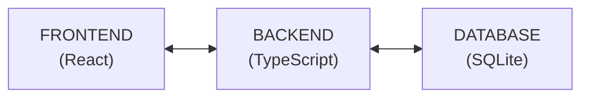
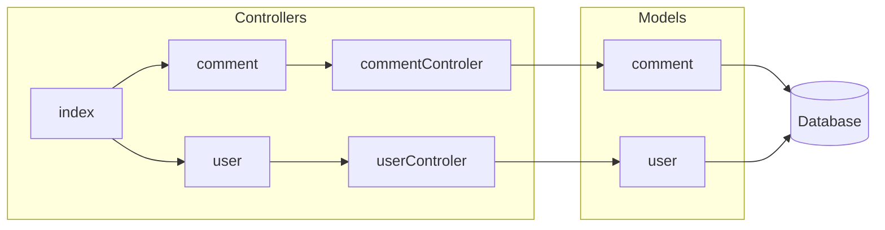
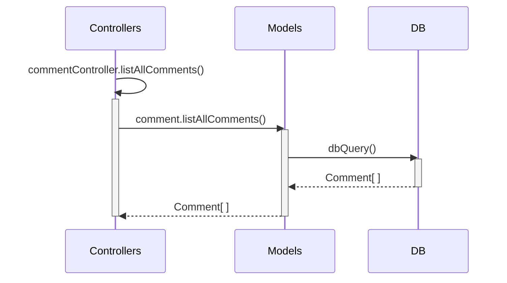
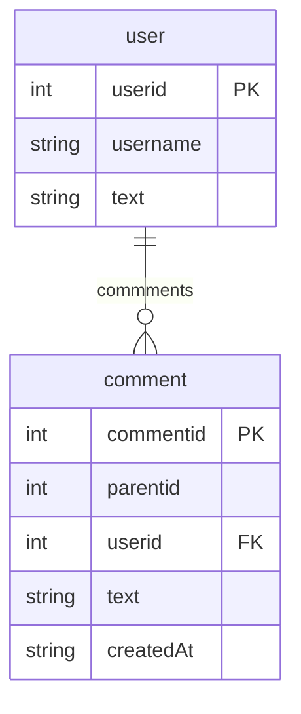

# ESM Fórum

O **ESM Fórum** é um sistema de demonstração do livro [Engenharia de Software Moderna](https://engsoftmoderna.info). O objetivo é permitir que os alunos tenham um primeiro contato prático com os conceitos estudados no livro. Ou seja, trata-se de um projeto com **objetivo didático** e, por isso, **não temos a intenção de colocá-lo em produção**.

O sistema é um fórum simples de perguntas e respostas, conforme ilustrado a seguir:

<p align="center">
    
</p>

Atualmente, ele é implementado em TypeScript, usando Node.js, React e SQLite.

Informações para instalação e execução podem ser encontradas [aqui](https://github.com/aserg-ufmg/esmforum/blob/main/install-info.md).

## Histórias de Usuário

#### Backlog do Produto

As histórias de usuário do sistema -- que fazem parte do **backlog do produto** -- são as seguintes:

* Como usuário, eu gostaria de criar, editar e deletar uma pergunta
* Como usuário, eu gostaria de responder uma pergunta
* Como usuário, eu gostaria de favoritar uma pergunta ou resposta
* Como usuário, eu gostaria de me cadastrar no sistema
* Como usuário, eu gostaria de adicionar tags nas minhas perguntas, bem como removê-las, se for preciso.
* Como usuário, eu gostaria de pesquisar por perguntas ou respostas
* Como administrador, eu gostaria de editar ou remover perguntas ou respostas de qualquer usuário
* Como administrador, eu gostaria de adicionar ou remover tags de qualquer pergunta ou resposta

#### Backlog do Sprint

Até este momento, apenas o primeiro sprint foi concluído e implementado. As histórias implementadas neste sprint -- ou seja, as histórias que fizeram parte do **backlog do sprint** -- foram as seguintes:

* Como usuário, eu gostaria de criar uma pergunta
* Como usuário, eu gostaria de responder uma pergunta
* Como usuário, eu gostaria de editar uma das minhas perguntas ou respostas
* Como usuário, eu gostaria de deletar uma das minhas perguntas ou respostas

Veja que começamos com um conjunto de funcionalidades mais importantes em um sistema como o ESM Fórum. Em outras palavras, neste primeiro sprint, o que implementamos foi um CRUD de perguntas e respostas. Para quem ainda não conhece, CRUD é uma sigla que significa Criar, Listar (Read), Atualizar (Update) e Deletar um tipo de dado. 

Por outro lado, não nos preocupamos ainda com outras funcionalidades, como cadastro de usuários. Ou seja, neste primeiro sprint, estamos assumindo que existe um único usuário no sistema, que já se encontra logado e habilitado para postar e responder perguntas. 

#### Tarefas

No backlog do sprint, para cada história também existe uma lista de tarefas, as quais são necessárias para implementar a história. Por exemplo, as tarefas associadas à história "Como usuário, eu gostaria de criar uma pergunta" são as seguintes:

* Projetar o leiaute básico da interface (frontend);
* Projetar e criar as primeiras tabelas do banco de dados (backend)
* Implementar rotas para inserir, remover e recuperar perguntas e respostas (backend)
* Implementar uma primeira versão da interface, apenas com criação de perguntas (frontend)
* Implementar uma segunda versão da interface, com as demais operações sobre perguntas e respostas

## Arquitetura (Visão Geral)

Na próxima figura, mostramos um diagrama em alto nível da arquitetura do sistema e das principais
tecnologias usadas na sua implementação:



## Arquitetura do Backend

Agora, mostramos com mais detalhes a arquitetura do backend.



Essa arquitetura é similar a uma [arquitetura MVC](https://engsoftmoderna.info/cap7.html#arquitetura-mvc), conforme estudamos no Capítulo 7 do livro. 

No backend, a arquitetura possui três componentes principais: **controladores**, **modelos** e **banco de dados**. Iremos descrever cada um deles a seguir.

### Controladores 

O backend é acessado por meio de uma interface REST, isto é, de forma resumida, via uma interface formada por um conjunto de URLs. 

No caso de REST, essas URLs são chamadas de **rotas**. Mostramos a seguir a declaração de uma rota que lista todos os comentários de uma pergunta (o código completo está [src/routes/comments.ts](https://github.com/aserg-ufmg/esmforum/blob/main/src/routes/comment.ts).

```
import { Router } from 'express'
import { commentController } from '../controllers/commentController'

export const commentRouter = Router()
commentRouter.get('/', commentController.listAllComments)
```

Para implementar as rotas usamos uma biblioteca chamada [Express.js](https://expressjs.com/). No código acima, primeiro importamos o componente ``Router`` dessa biblioteca e depois importamos todas as funções do componente ``commentController``, as quais estão implementadas em [commentController.ts](https://github.com/aserg-ufmg/esmforum/blob/main/src/controllers/commentController.ts). 

Nas duas últimas linhas do código acima, criamos um roteador e uma rota, a qual associa a URL "/comment" com a função ``CommentController.listAllComments``. Ou seja, quando o frontend acessar a URL `/comment`, a função ``listAllComments`` será automaticamente chamada.

### Modelo

Como dissemos, atualmente o sistema é um CRUD simples de perguntas e respostas. As funções CRUD (cadastrar, listar, atualizar e deletar) são implementadas na camada de modelo.

Por exemplo, a seguir ilustramos a implementação do método `listAllComments` que lista todos os comentários já realizados (veja o código completo em [models/comment.ts](https://github.com/aserg-ufmg/esmforum/blob/main/src/models/comment.ts)):

```
import { dbQuery, dbQueryFirst } from '../utils/database'

export type Comment = {
  commentid: number
  parentid: number
  userid: number
  text: string
  createdAt: Date
}

const listAllComments = async () => {
  const out = await dbQuery('SELECT * FROM comment')
  return out as Comment[]
}
```

Veja que primeiro definimos um tipo `Comment`, com campos para armazena o ID do comentário e do seu pai, o ID do usuário que fez o comentário, o texto do comentário propriamente dito e a data de criação do comentário.

A implementação do método `listAllComments`, mostrada nas linhas finais do código, é bastante simples. Ela chama a função auxiliar `dbQuery` (implementada em [src/utils/database.ts](https://github.com/aserg-ufmg/esmforum/blob/main/src/utils/database.ts)), para realizar um `select` simples no banco de dados. O resultado de `listAllComments` é uma lista de objetos do tipo `Comment`.

O seguinte diagrama de sequência ilustra as chamadas de métodos descritas acima:




Além da função `listAllComments`, outras funções similares são implementadas na camada de Modelo da nossa arquitetura, incluindo funções como `getComment`, `insertComment`, `updateComment`, `listComments` e `deleteComment`. Veja o código delas em [models/comment.ts](https://github.com/aserg-ufmg/esmforum/blob/main/src/models/comment.ts).

### Banco de Dados

Inicialmente, mostramos o comando SQL para criação das duas tabelas usadas no sistema (`comment` e `user`):

```
CREATE TABLE "comment" (
	"commentid"	INTEGER,
	"parentid"	INTEGER,
	"userid"	INTEGER,
	"text"	TEXT,
	"createdAt"	TEXT,
	PRIMARY KEY("commentid" AUTOINCREMENT),
	FOREIGN KEY("userid") REFERENCES "user"("userid") ON DELETE CASCADE
)

CREATE TABLE "user" (
	"userid"	INTEGER,
	"username"	TEXT,
	"email"	TEXT,
	PRIMARY KEY("userid" AUTOINCREMENT)
)
```

Mostramos também o Diagrama Entidade-Relacionamento (DER) do nosso banco de dados.


Fisicamente, o banco de dados fica armazenado no arquivo ``/src/forum.db``. Para acessá-lo, usamos duas funções a partir da biblioteca [SQLite3](github.com/TryGhost/node-sqlite3):

* ``utils/database/dbQuery``: função responsável por realizar conexão com o banco de dados e retornar lista de todos os items a partir de query de entrada.
* ``utils/database/dbQueryFirst``: função que realiza conexão com o banco de dados e retorna primeiro item da lista retornada a partir de query de entrada.

Para ilustração, portanto, do fluxo de execução dado o acesso do frontend à URL "/comment", temos o seguinte diagrama de sequência:

## Arquitetura do Frontend

Todo.

