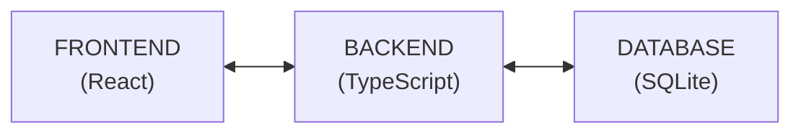
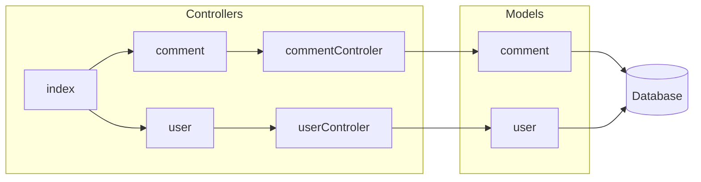
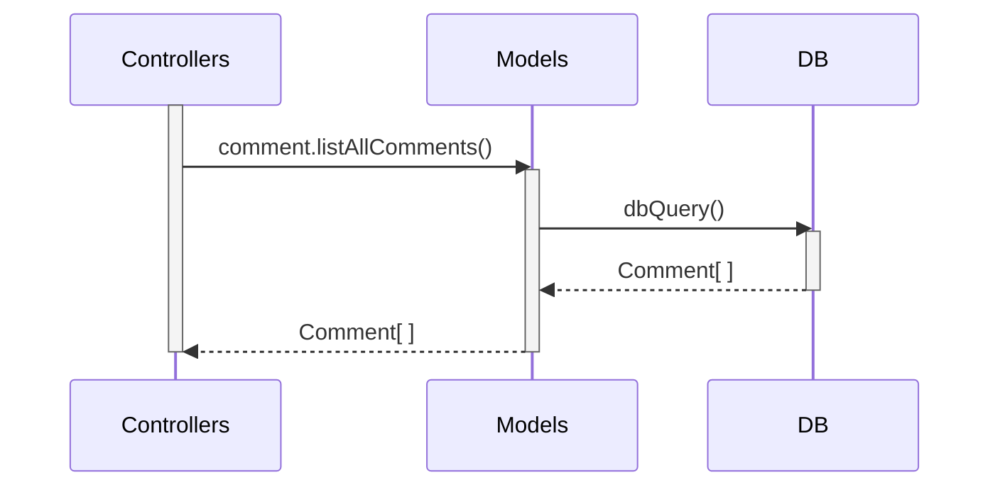
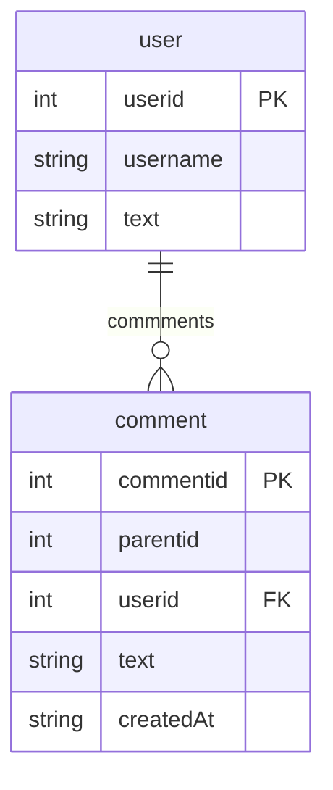

# ESM Fórum

## Arquitetura do Backend

Primeiro, mostramos um diagrama em alto nível da arquitetura do sistema e das principais
tecnologias usadas na sua implementação:



Agora, mostramos com mais detalhes a **arquitetura do backend**.



Essa arquitetura é similar a uma [arquitetura MVC](https://engsoftmoderna.info/cap7.html#arquitetura-mvc), conforme estudamos no Capítulo 7 do livro. 

No backend, a arquitetura possui três componentes principais: **controladores**, **modelos** e **banco de dados**. Iremos descrever cada um deles a seguir.

## Controladores 

O backend é acessado por meio de uma interface REST, isto é, de forma resumida, via uma interface formada por um conjunto de URLs. 

No caso de REST, essas URLs são chamadas de **rotas**. Mostramos a seguir a declaração de uma rota que lista todos os comentários de uma pergunta (o código completo está [src/routes/comments.ts](https://github.com/aserg-ufmg/esmforum/blob/main/src/routes/comment.ts).

```
import { Router } from 'express'
import { commentController } from '../controllers/commentController'

export const commentRouter = Router()
commentRouter.get('/', commentController.listAllComments)
```

Para implementar as rotas usamos uma biblioteca chamada [Express.js](https://expressjs.com/). No código acima, primeiro importamos o componente ``Router`` dessa biblioteca e depois importamos todas as funções do componente ``commentController``, as quais estão implementadas em [commentController.ts](https://github.com/aserg-ufmg/esmforum/blob/main/src/controllers/commentController.ts). 

Nas duas últimas linhas do código acima, criamos um roteador e uma rota, a qual associa a URL "/comment" com a função ``CommentController.listAllComments``. Ou seja, quando o frontend acessar a URL `/comment`, a função ``listAllComments`` será automaticamente chamada.

## Modelo

Como dissemos, atualmente o sistema é um CRUD simples de perguntas e respostas. As funções CRUD (cadastrar, listar, atualizar e deletar) são implementadas na camada de modelo.

Por exemplo, a seguir ilustramos a implementação do método `listAllComments` que lista todos os comentários já realizados (veja o código completo em [models/comment.ts](https://github.com/aserg-ufmg/esmforum/blob/main/src/models/comment.ts)):

```
import { dbQuery, dbQueryFirst } from '../utils/database'

export type Comment = {
  commentid: number
  parentid: number
  userid: number
  text: string
  createdAt: Date
}

const listAllComments = async () => {
  const out = await dbQuery('SELECT * FROM comment')
  return out as Comment[]
}
```

Veja que primeiro definimos um tipo `Comment`, com campos para armazena o ID do comentário e do seu pai, o ID do usuário que fez o comentário, o texto do comentário propriamente dito e a data de criação do comentário.

A implementação do método `listAllComments`, mostrada nas linhas finais do código, é bastante simples. Ela chama a função auxiliar `dbQuery` (implementada em [src/utils/database.ts](https://github.com/aserg-ufmg/esmforum/blob/main/src/utils/database.ts)), para realizar um `select` simples no banco de dados. O resultado de `listAllComments` é uma lista de objetos do tipo `Comment`.

O seguinte diagrama de sequência ilustra as chamadas de métodos descritas acima:




Além da função `listAllComments`, outras funções similares são implementadas na camada de Modelo da nossa arquitetura, incluindo funções como `getComment`, `insertComment`, `updateComment`, `listComments` e `deleteComment`. Veja o código delas em [models/comment.ts](https://github.com/aserg-ufmg/esmforum/blob/main/src/models/comment.ts).

## Banco de Dados

Inicialmente, mostramos o comando SQL para criação das duas tabelas usadas no sistema (`comment` e `user`):

```
CREATE TABLE "comment" (
	"commentid"	INTEGER,
	"parentid"	INTEGER,
	"userid"	INTEGER,
	"text"	TEXT,
	"createdAt"	TEXT,
	PRIMARY KEY("commentid" AUTOINCREMENT),
	FOREIGN KEY("userid") REFERENCES "user"("userid") ON DELETE CASCADE
)

CREATE TABLE "user" (
	"userid"	INTEGER,
	"username"	TEXT,
	"email"	TEXT,
	PRIMARY KEY("userid" AUTOINCREMENT)
)
```

Mostramos também o Diagrama Entidade-Relacionamento (DER) do nosso banco de dados.


Fisicamente, o banco de dados fica armazenado no arquivo ``/src/forum.db``. Para acessá-lo, usamos as seguintes funções (as quais estão implementadas em [utils/database.ts](https://github.com/aserg-ufmg/esmforum/blob/main/src/utils/database.ts)):

* ``dbQuery(String query)``: conecta-se com o BD, executa a query informada como parâmetro e retorna uma lista com todos os resultados da query.
* ``dbQueryFirst``: conecta-se com o BD, executa a query informada como parâmetro e retorna apenas o primeiro item da lista de resultados da query.
 
